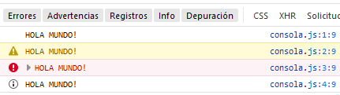
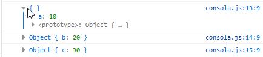
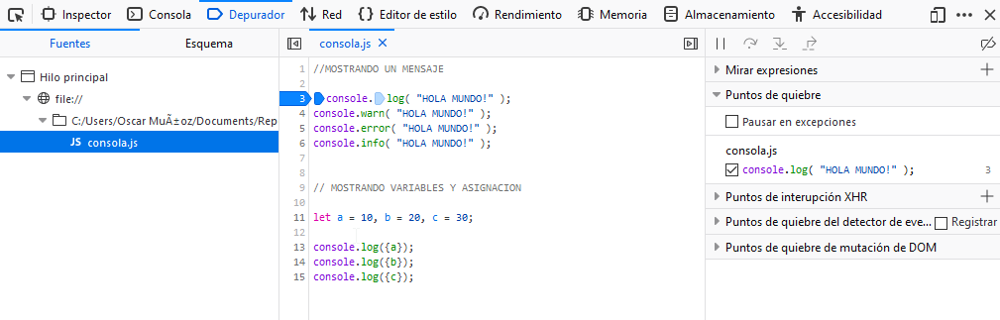

# Sección 1
Bienvenido a la sección 1, dentro de esta sección vamos a ver:
1. Usos de javascript
2. Primer Hola mundo!
3. Introducción a variables y comentarios
4. Introducción a la consola.
5. Depuración y breakpoints
6. Prompt, confirm y alert

## 1 Usos de Javascript
JS nacio con la necesidad de mandar informacion al servidor lo mas procesado posible, pero hoy en dia es un poco diferente
porque js es un monopolio, no importa si te servidor está corriendo en php, java o python en un 99% vas a necesitar js.
Ejemplo de uso de javascript:
1. Dashborad (uso de busqueda, graficos, etc)
2. [google maps](https://maps.goole.cl)
3. Crear presentaciones (wooh) con reveal.js
4. Crear web-serves con node, vamos a poder crear servidores, crear peticiones, conectar base de datos, conección en tiempo real
con sockets.
5. Crear juego como [Underrun](https://js13kgames.com/games/underrun/index.html)
6. Crear app moviles con Ionic, React native, NavitiveScript
7. Tambien ocupar framework como angular y librerias React.js y Vue.js

## 2. Hola mundo!
```javascript
// MI PRIMERA LINEA DE COMANDO EN JS
console.log("HOLA MUNDO!");
```
El console.log va a imprimir por consola el argumento enviado, en este caso es "HOLA MUNDO!".

```javascript
//VAMOS A IMPRIMIR EL HOLA MUNDO EN TODO EL HMTL, REEMPLAZANDO LO QUE HAY DENTRO DEL HTML
document.write("HOLA MUNDO!");
```

Existe una forma de compilar nuestro codigo js y es por medio de node, instalamos y dentro de la consola escribimos lo siguiente
```node
node nombre-archivo.js
```

## 3. Introducción a variable y comentarios
Un comentario son lineas de codigo que el interprete de js va a ignorar, a nosotros nos sirve para la documentación.

Existen varias formas de hacer comentarios en js
```js
 // comentraio en js


 /**
  * comentario en bloque
  * */
```

Una variable es un contenedor de información que apunta a un lugar en memoria, esta información puede ser cambiada en el futuro.

javascript tiene 3 formas (o mas) de declarar variablas, ejemplo.

```js
let a = 10; // let es un tipo de variable que se destruye a penas termine el bloque de codigo
var b = 10; // mientras que var se mantiene durante toda la ejecucuón.
const c = 10; //este tipo de variable es constante, por lo no tiene que ser cambiado en el futuro por algo es constante y no variable
```

## 4. Introducción a la consola
Js es un lenguaje interpretado, eso quiere decir que cuando carguemos nuestro archivo va a ejecutar linea por linea. 

Cuando lleguamos a un console.log() lo que decimos es "imprime eso en consola", los mensaje en consola son utilizados para no intervenir el flujo normal de la ejecución, podemos ocuapr los siguientes mensajes en consola:
```js
console.log( "HOLA MUNDO!" ) // MENSAJE POR CONSOLA NORMAL
console.warn( "HOLA MUNDO!" ) // MENSAJE POR CONSOLA QUE PARECE UN WARNING
console.error( "HOLA MUNDO!" ) // MENSAJE DE CONSOLA QUE PARECE UN ERROR
console.info ( "HOLA MUNDO!" ) // MENSAJE DE INFORMACIÓN

```
Esto es lo que muestra la consola del navegador



Para mostrar variables con su respectivo valor vamos hacer lo siguiente
```js
let a = 10, b = 20, c = 30;

console.log({a});
console.log({b});
console.log({c});

```

Y el navegador va a mostrar algo como esto:



## 5. Depuración y breakpoint

Hace un breakpoint en js es inspeccionar el elemento en el navegardor y seleccionar una linea en el apartado "depurador" (en mozilla) luego recargar la pagina y la esta se va a quedar dando vuelta hasta que comenzemos a dar siguiente, siguiente ... la gracia de hacer breakpoint en un lenguaje es saber como se estan comportando nuestro codigo, que asignaciones va adquiriendo.



## 6. Promt, confirm y alert.
